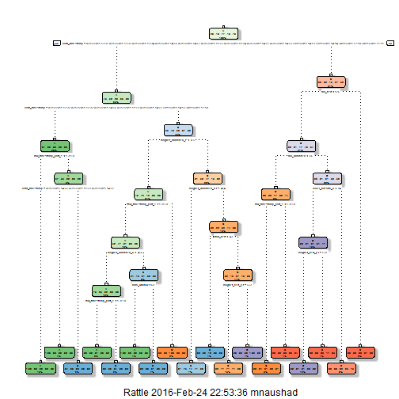

# Synopsis

Using devices such as Jawbone Up, Nike FuelBand, and Fitbit it is now possible to collect a large amount of data about personal activity relatively inexpensively. These type of devices are part of the quantified self movement - a group of enthusiasts who take measurements about themselves regularly to improve their health, to find patterns in their behavior, or because they are tech geeks. One thing that people regularly do is quantify how much of a particular activity they do, but they rarely quantify how well they do it. In this project, your goal will be to use data from accelerometers on the belt, forearm, arm, and dumbell of 6 participants. They were asked to perform barbell lifts correctly and incorrectly in 5 different ways. More information is available from the website - [http://groupware.les.inf.puc-rio.br/har](http://groupware.les.inf.puc-rio.br/har)

The purpose of this report is to predict the manner in which they did the exercise. This is the "classe" variable in the training set. You may use any of the other variables to predict with. You should create a report describing how you built your model, how you used cross validation, what you think the expected out of sample error is, and why you made the choices you did. You will also use your prediction model to predict 20 different test cases. 

## Source of Data

The training data for this project are available here: 
[https://d396qusza40orc.cloudfront.net/predmachlearn/pml-training.csv](https://d396qusza40orc.cloudfront.net/predmachlearn/pml-training.csv)

The test data are available here:
[https://d396qusza40orc.cloudfront.net/predmachlearn/pml-testing.csv](https://d396qusza40orc.cloudfront.net/predmachlearn/pml-testing.csv) 

# Loading Data and Perform quick analysis

The following Libraries were used for this project.

```r
library(caret)
library(rpart)
library(rpart.plot)
library(RColorBrewer)
library(rattle)
library(randomForest)
```

Load the same seed with the following line of code:

```r
set.seed(12345)
```

## Data Load

```r
if (!file.exists("./data/pml-training.csv")) {
    fileURL <- 'https://d396qusza40orc.cloudfront.net/predmachlearn/pml-training.csv'
    download.file(fileURL, destfile='./data/pml-training.csv', method = 'libcurl')
}

training <- read.csv("./data/pml-training.csv", na.strings = c("NA", ""))

if (!file.exists("./data/pml-testing.csv")) {
    fileURL <- 'https://d396qusza40orc.cloudfront.net/predmachlearn/pml-testing.csv'
    download.file(fileURL, destfile='./data/pml-testing.csv', method = 'libcurl')
}

testing <- read.csv("./data/pml-testing.csv", na.strings = c("NA", ""))

dim(training)
```

```
## [1] 19622   160
```

```r
summary(training$classe)
```

```
##    A    B    C    D    E 
## 5580 3797 3422 3216 3607
```

There are *19622* records with *160* variables. The variable we will be predicting on is *classe*, and the data is splited up between the five classes.

# Building Model

## Split the Training Data

Here, the training data is splitting up into a training set to train the model and a testing set to test the performanace of the model -

```r
inTrain = createDataPartition(y=training$classe, p=0.6, list=FALSE)
modelTraining = training[inTrain,]
modelTesting = training[-inTrain,]
dim(modelTraining)
```

```
## [1] 11776   160
```

```r
dim(modelTesting)
```

```
## [1] 7846  160
```

There are *159* variables available to use for training the model.

## Cleaning Data

In order to cleaning up the data, the below code removes *Near *Zero *Variance variables from both training and testing data

```r
nzv <- nearZeroVar(modelTraining, saveMetrics=TRUE)
modelTraining <- modelTraining[,nzv$nzv==FALSE]

nzv<- nearZeroVar(modelTesting,saveMetrics=TRUE)
modelTesting <- modelTesting[,nzv$nzv==FALSE]
```

The first column of the Training data set is also removed. 

```r
modelTraining <- modelTraining[c(-1)]
```

As part of data cleaning, below code is used to clean up variables with more than 60% NA

```r
# creating a copy of training set to iterate in loop
trainingT <- modelTraining                                                            
# for every column in the training dataset
for(i in 1:length(modelTraining)) {                                                   
  # check if NAs > 60% of total observations      
  if( sum( is.na( modelTraining[, i] ) ) /nrow(modelTraining) >= .6 ) {         
    for(j in 1:length(trainingT)) {
      # look for the matching column
      if( length( grep(names(modelTraining[i]), names(trainingT)[j]) ) ==1)  {  
        # Remove the column when matching column      
        trainingT <- trainingT[ , -j]                                         
            }   
        } 
    }
}

# Set back to the original variable name
modelTraining <- trainingT
dim(modelTraining)
```

```
## [1] 11776    58
```

Here same cleaning as above is performed for modelTesting and Testing data set

```r
clean1 <- colnames(modelTraining)
# remove the classe column
clean2 <- colnames(modelTraining[, -58])      
# allow only variables in modelTesting that are also in modelTraining
modelTesting <- modelTesting[clean1]          
# allow only variables in testing that are also in modelTraining
testing <- testing[clean2]                    

dim(modelTesting)
```

```
## [1] 7846   58
```

```r
dim(testing)
```

```
## [1] 20 57
```

In order to ensure proper functioning of Decision Trees and RandomForest algorithm with the Test data set, the below code is used to coerce the data into the same type.

```r
for (i in 1:length(testing) ) {
        for(j in 1:length(modelTraining)) {
        if( length( grep(names(modelTraining[i]), names(testing)[j]) ) ==1)  {
            class(testing[j]) <- class(modelTraining[i])
        }      
    }      
}

# To make sure coercion works, following code is used -
testing <- rbind(modelTraining[2, -58] , testing) 
testing <- testing[-1,]
dim(testing)
```

```
## [1] 20 57
```

# Prediction

## Prediction with Decision Tree

```r
set.seed(12345)
modelFitA <- rpart(classe ~ ., data=modelTraining, method="class")
fancyRpartPlot(modelFitA)
```




```r
predictionsA <- predict(modelFitA, modelTesting, type = "class")
confusionMatrix(predictionsA, modelTesting$classe)
```

```
## Confusion Matrix and Statistics
## 
##           Reference
## Prediction    A    B    C    D    E
##          A 2150   60    7    1    0
##          B   61 1260   69   64    0
##          C   21  188 1269  143    4
##          D    0   10   14  857   78
##          E    0    0    9  221 1360
## 
## Overall Statistics
##                                           
##                Accuracy : 0.8789          
##                  95% CI : (0.8715, 0.8861)
##     No Information Rate : 0.2845          
##     P-Value [Acc > NIR] : < 2.2e-16       
##                                           
##                   Kappa : 0.8468          
##  Mcnemar's Test P-Value : NA              
## 
## Statistics by Class:
## 
##                      Class: A Class: B Class: C Class: D Class: E
## Sensitivity            0.9633   0.8300   0.9276   0.6664   0.9431
## Specificity            0.9879   0.9693   0.9450   0.9845   0.9641
## Pos Pred Value         0.9693   0.8666   0.7809   0.8936   0.8553
## Neg Pred Value         0.9854   0.9596   0.9841   0.9377   0.9869
## Prevalence             0.2845   0.1935   0.1744   0.1639   0.1838
## Detection Rate         0.2740   0.1606   0.1617   0.1092   0.1733
## Detection Prevalence   0.2827   0.1853   0.2071   0.1222   0.2027
## Balanced Accuracy      0.9756   0.8997   0.9363   0.8254   0.9536
```

## Prediction with Random Forests

```r
set.seed(12345)
modelFitB <- randomForest(classe ~ ., data=modelTraining)
predictionB <- predict(modelFitB, modelTesting, type = "class")
confusionMatrix(predictionB, modelTesting$classe)
```

```
## Confusion Matrix and Statistics
## 
##           Reference
## Prediction    A    B    C    D    E
##          A 2231    2    0    0    0
##          B    1 1516    0    0    0
##          C    0    0 1367    3    0
##          D    0    0    1 1282    1
##          E    0    0    0    1 1441
## 
## Overall Statistics
##                                           
##                Accuracy : 0.9989          
##                  95% CI : (0.9978, 0.9995)
##     No Information Rate : 0.2845          
##     P-Value [Acc > NIR] : < 2.2e-16       
##                                           
##                   Kappa : 0.9985          
##  Mcnemar's Test P-Value : NA              
## 
## Statistics by Class:
## 
##                      Class: A Class: B Class: C Class: D Class: E
## Sensitivity            0.9996   0.9987   0.9993   0.9969   0.9993
## Specificity            0.9996   0.9998   0.9995   0.9997   0.9998
## Pos Pred Value         0.9991   0.9993   0.9978   0.9984   0.9993
## Neg Pred Value         0.9998   0.9997   0.9998   0.9994   0.9998
## Prevalence             0.2845   0.1935   0.1744   0.1639   0.1838
## Detection Rate         0.2843   0.1932   0.1742   0.1634   0.1837
## Detection Prevalence   0.2846   0.1933   0.1746   0.1637   0.1838
## Balanced Accuracy      0.9996   0.9993   0.9994   0.9983   0.9996
```

As we see from the confusion matrix data, Random Forests gave an accuracy in the myTesting dataset of *99.89%*, and accuracy from Decision Trees is *87.89%*. Therefore, Random Forests yielded better accuracy with out of sample error (100 - 99.89) = *0.11%*

# Predicting Results on Test Data

```r
predictionTestData <- predict(modelFitB, testing, type = "class")
predictionTestData
```

```
##  2 31  4  5  6  7  8  9 10 11 12 13 14 15 16 17 18 19 20 21 
##  B  A  B  A  A  E  D  B  A  A  B  C  B  A  E  E  A  B  B  B 
## Levels: A B C D E
```
